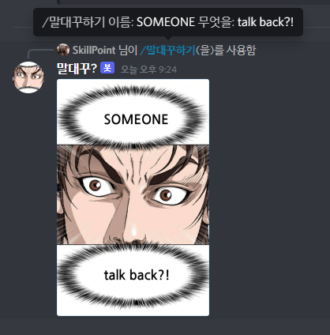

# XX talks back?

<div align="center">
  <br />
  <p>
    <a href="https://namu.wiki/w/여자가⋯ 말대꾸⁈"></a>
  </p>
</div>

## Introduce

Kang Gun-ma's line from the 13th episode of "쇼더럭키짱!"(Show the Lucky Jjang!) by Kim Sung-mo, "A XXX is XXX?!" Meme create discord bot.

## View Webtoon from
[Link to Naver webtoon](https://comic.naver.com/webtoon/list?titleId=783054)

*Naver is a Korean company that provides webtoons.*


## Use Example.
<div align="center">
  
</div>

## Bot Created What?
[discord.js](https://github.com/discordjs/discord.js) with TypeScript Version 4.4.4

# Installation
MDG is created by TypeScript. Therefore, Node.js should be installed on your computer.
If not installed, Check [How to install Node.js](#how-to-install-nodejs)

## How to install Node.js

**For Windows**
1. Go into https://nodejs.org/en/
2. Install LTS Version.
3. After install, open cmd.

try executing the commands below to the command prompt.

```sh
node -v
npm -v
```

If it all works well, the installation is over.


**For Linux or Ubuntu**
- You should be installed CRUL.

```sh
sudo yum install -y nodejs
```

After the installation, try executing the commands below to the terminal.

```sh
node -v
npm -v
```

If it all works well, the installation is over.

## How to install MDG (Discord Bot)

**For Windows**
- Go into https://github.com/Hostagen/maledaeggu
- Click the `Code` button.
- Then, click the `Download ZIP`
- Unzip the files to the desired location.

**For Linux or Ubuntu**
- You should be installed git.

```sh
git clone https://github.com/Hostagen/maledaeggu.git
```

## How to I create Application and invite it.

1. Go into https://discord.com/developers/applications/
2. Click the "New Application" blue button at the top right.
3. Enter Name of Application Name (Application is not bot name.)
4. Go to "Bot" Section and Click the "Add Bot" button at right.
5. Go back to the "General Information" tab and copy "APPLICATION ID"
6. Paste the copied Application ID in the place of the APPLICATION ID below url.
https://discord.com/api/oauth2/authorize?client_id=APPLICATION_ID&permissions=0&scope=bot%20applications.commands

This is the invite link of the bot.

## How to I setup the config.json

After Install MDG files, you should create the config.json

1. Create "config.json", copy and paste the text below.

```json
{
    "token": "BOT_TOKEN",
    "guildId": "GUILD_ID"
}
```

2. Put your bot token in the "BOT_TOKEN" place.
3. If you want to use the command only your server and want to register quickly, copy your Guild ID and put it on "GUILD_ID".

Set "GUILD_ID" to `null` if you want to register the command globally.

It will take about an hour for register command. Register your Guild ID for immediate use.

## Install modules.

If you not installed Node.js, Check [Here.](#how-to-install-nodejs)

1. open command propte or terminal on where unzipped bot files.
2. execute `npm install` and wait util everything is installed.
3. enter commands below.

```sh
tsc
npm start
```

Now bot will be started.

# Commands

## 말대꾸하기
Start Talking back.

### Options
- 이름: name
- 무엇을?: what
